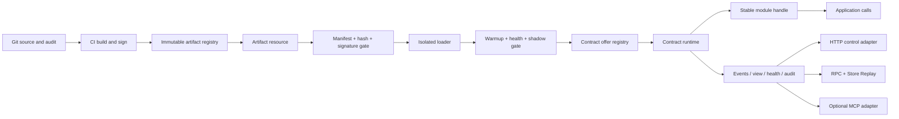

# Dynamic runtime architecture

Status: canonical architecture plus an internal, non-exported first vertical slice. This document
does not add a public package API or authorize execution of arbitrary downloaded code.

Read this together with [`CONTRACT-RUNTIME.md`](CONTRACT-RUNTIME.md),
[`ARTIFACT-RUNTIME.md`](ARTIFACT-RUNTIME.md), and, before exposing a control surface over RPC,
[`RPC-AUTH.md`](RPC-AUTH.md). A ready prompt for a separate implementation task lives in
[`prompts/IMPLEMENT-DYNAMIC-RUNTIME.md`](prompts/IMPLEMENT-DYNAMIC-RUNTIME.md). The first dynamic
MCP-contribution slice is ready in
[`prompts/IMPLEMENT-MCP-CONTRIBUTION-GATEWAY.md`](prompts/IMPLEMENT-MCP-CONTRIBUTION-GATEWAY.md).
The design-time architect role is ready in
[`prompts/MCP-ARCHITECT.md`](prompts/MCP-ARCHITECT.md). The agent-facing plain-HTTP control surface
plus development hot-reload instruction is
[`prompts/IMPLEMENT-AGENT-HTTP-CONTROL.md`](prompts/IMPLEMENT-AGENT-HTTP-CONTROL.md).
Exact implemented files, wire behavior, tests, and remaining production gates are recorded in
[`DYNAMIC-RUNTIME-IMPLEMENTATION.md`](DYNAMIC-RUNTIME-IMPLEMENTATION.md).

## Decision in one page

`wenay-common2` is the contract and data-plane toolkit. The application host owns code loading,
isolation, rollout, Git/registry integration, permissions, persistence, audit, and deployment.
The host adapts a verified isolated module into a `ContractOffer`; the existing
`Contract.createContractRuntime` selects and prepares the offer, performs the atomic binding swap,
leases calls to one binding generation, drains the retired session, and provides rollback,
status, history, and explanation.



The hot path is intentionally short:

```text
stable handle -> acquire lease -> call active api -> release lease
```

Fetching, hashing, signature verification, instantiation, warmup, tests, migrations, and audit are
control-plane work and never run in that path.

The current internal slice implements inert manifest validation, integrity/signature/policy gates,
a verifier-owned artifact capability, Node worker isolation for permission-free signed first-party
factory bundles, stable leased calls, dependency brokering, stage/health/activate/rollback, and a
temporary loopback MCP adapter exercised by its own official client. An external reference
control plane under `experiments/dynamic-runtime` now adds immutable Git-provenance publication,
content-addressed single-flight delivery, restart-safe desired state/receipts/audit/LKG, fenced
three-node canary rollout, quarantine, and automatic rollback. Both parts intentionally remain
unexported. Versioned business-state migration, authoritative output gating, production registry/
database adapters, hard CPU/capability isolation, and real distributed consensus remain deferred.

## What already exists

The generated declarations were used as the public-surface map and the behavior was confirmed in
source, tests, and public docs.

| Existing primitive | Reuse in this design | Important limit |
| --- | --- | --- |
| `Contract.createContractOffers` | In-memory registry of ready `ContractOffer` values | It is not an artifact registry or loader |
| `Contract.resolveContractBinding` | Compatibility and policy selection before `open()` | Signature and hash fields are only policy seams |
| `Contract.createContractRuntime` | Prepare-before-switch, atomic active binding, lease/drain, failure fallback, revoke/restore, rollback, status/history/explain | `ContractOffer.open()` must receive only already verified code or a remote facade |
| `Artifact.sha256Hex` | Canonical SHA-256 helper | A hash proves content identity, not publisher authenticity |
| `Artifact.createArtifactByteCache` | Almost the needed content-addressed fetch/cache; prefer an adapter or a later generic extraction | Its present input is `ArtifactRecord`; executable-module policy does not belong in `ArtifactHost` |
| `Observe.createStore` plus Store Replay | Authoritative status, resumable facts, browser mirrors, reconnect catch-up | A replay sequence alone is not a business-command id |
| `Observe.syncStoreReplayRoute` | Replaceable replay route where a continuous mirror is needed | It switches data sources, not executable code |
| RPC facades and `Listen` | Typed remote calls and outward event streams | Authorization must follow `RPC-AUTH.md` |
| `createHttpFacadeServer` from `wenay-common2/server` | Static GET/POST mirror for a safe control/view facade with Express middleware | Request/response only; no callbacks, `Listen`, SSE, dynamic route keys, or binary download |

Relevant implementation evidence:

- `lib/index.d.ts`, `lib/server.d.ts`, and `lib/Common/contract/*.d.ts` define the existing public
  map.
- `src/Common/contract/contract-runtime.ts` owns binding replacement and session retirement.
- `observe/contract-runtime.test.ts` pins failed-candidate safety, lease draining, rollback, and
  optional degradation.
- `oracle/realsocket/contract-runtime.spec.ts` pins replacement over real RPC while the Store Replay
  mirror remains continuous.
- `src/Common/artifact/artifact-cache.ts` verifies fetched bytes against the content hash before
  caching them.
- `src/server/httpFacadeServer.ts` performs the one-time static function-tree-to-route walk.

Do not create a second binding runtime, registry, replay protocol, generic HTTP mapper, or generic
MCP implementation. Wrap these corridors where they almost fit.

## Ownership boundary

### Inside `wenay-common2`

Only host-neutral, deterministic building blocks belong here:

- versioned manifest/descriptor types and pure validation, after explicit public-API approval;
- compatibility and policy contracts;
- stable handle/lease and binding events, already substantially represented by Contract runtime;
- typed unavailable/degraded results;
- transport-neutral control/view/event facade shapes;
- a minimal MCP-contribution descriptor and authoring helper, only after an explicit public-API
  decision;
- reusable content hashing and possibly a generic content-addressed byte-cache extraction;
- test fixtures for deterministic activation races and failure injection.

### Outside the library

The host/runtime/deployment project owns:

- Git checkout/watch and mapping a commit to a build request;
- CI build, package resolution, signing, immutable registry publication, and promotion channels;
- trusted publisher/key policy and signature verification;
- `worker_threads`, child-process, container, or service lifecycle;
- runtime capability enforcement, secrets, filesystem/network access, and resource limits;
- state stores, migrations, locks, audit persistence, canary policy, distributed coordination, and
  fleet rollout;
- MCP contribution gateway, lifetime/catalog policy, desired contribution state, agent context
  injection, and evidence retention;
- HTTP/RPC/MCP exposure, official SDK lifecycle, and principal-specific authorization.

This follows the repository's current shape: Contract runtime explicitly treats offers as owners of
loading/connection resources. The runtime owns only versioned binding policy and session lifecycle.

## Layers and facades

Every layer is a closure factory with one explicit `deps` object. A significant layer may contain
the same facade pattern recursively. Inputs flow down through `deps`; facts flow up through
events. Implementation types are derived with `ReturnType<typeof createX>`.

The target top-level shape is an API sketch, not an approved export:

```ts
function createModuleRuntime(deps: ModuleRuntimeDeps) {
    return {
        control: {
            stage: async (request: StageRequest) => {},
            verify: async (candidateId: string) => {},
            activate: async (candidateId: string) => {},
            rollback: async (moduleId: string, target?: ModuleVersion) => {},
            revoke: async (version: ModuleVersion, reason: string) => {},
        },
        resource: {
            resolve: async (ref: ModuleArtifactRef) => {},
            fetch: async (descriptor: ModuleDescriptor) => {},
        },
        events: {
            changed: moduleChangedListen,
            failed: moduleFailedListen,
        },
        view: {
            snapshot: () => moduleStore.snapshot(),
            explain: (moduleId: string) => {},
        },
        health: {
            snapshot: () => healthStore.snapshot(),
        },
        close,
    }
}

export type ModuleRuntime = ReturnType<typeof createModuleRuntime>
```

The resource facet returns bytes and provenance evidence but never activates. The verifier returns
a verified candidate but never imports it. The isolated loader creates a session but never changes
the active pointer. Candidate tests produce evidence but never publish authoritative application
events. The activator is the only corridor allowed to register/choose the offer.

## Scopes and dynamically created objects

Dynamic means attachable and replaceable, not necessarily temporary. Every contribution declares
an owner and lifetime. Many objects used while checking or generating a version are intentionally
temporary, while host and active-generation contributions may remain available for a long time.

| Scope | Lifetime | Owns | Disposal rule |
| --- | --- | --- | --- |
| `HostScope` | Process lifetime | control facade, verified cache, Contract runtime, stable ports, audit writer, last-known-good pointer | Close at host shutdown |
| `HostContributionLease` | Desired host configuration | stable authoring/operations MCP contribution, immutable artifact coordinate, isolation session | Recreate after restart; replace/revoke through an audited catalog generation |
| `BuildScope` | One development/CI build | compiler, prompt/guide inputs, generators, packager, reports | Always close after artifact plus evidence is produced |
| `CandidateScope` | One stage attempt | fetched bytes, verification evidence, isolated instance, warmup probes, test fixtures, shadow collectors, staged state | Reject/timeout closes everything; activation transfers only the session/resources explicitly owned by the generation |
| `VerificationSession` | One candidate check, mock run, or bounded production diagnostic | transient verification facade, fixtures, generated files, MCP catalog lease, reports, abort controller | Close on verdict, TTL, candidate rejection, operator cancellation, or bounded post-activation observation end |
| `ActiveGeneration` | One active version | runtime session, subscriptions, resource leases, output gate, optional generation MCP contribution | Retire after pointer and catalog-alias swap |
| `RetiredGeneration` | Drain window | only already leased work and cleanup handles | Close after zero leases or forced-drain deadline |
| `CallScope` / `StreamScope` | One call or stream | binding lease, abort signal, correlation/idempotency context | Release exactly once |

Testers, statistics collectors, generators, temporary MCP tools, and shadow sinks must not leak
into the active module facade. Each candidate owns a disposable stack. A failed step closes the
stack in reverse order. Activation does not keep a candidate's compiler, verifier, test harness,
temporary MCP catalog, or shadow collector alive unless a rollout policy explicitly leases one for
a bounded post-activation observation window.

## Manifest and descriptor

The manifest is parsed as inert data before any import, evaluation, hook call, or migration.
Unknown or unsupported manifest protocols fail closed. The immutable descriptor is the verified
identity produced from that manifest and the fetched bytes.

```ts
type ModuleManifest = {
    manifestProtocol: 1
    moduleId: string
    version: string
    contentHash: `sha256:${string}`
    entrypoint: string

    compatibility: {
        api: {contractId: string, version: string}
        schema?: {id: string, version: string}
        state?: {id: string, version: string}
        runtime?: {name: 'node' | 'browser', range: string}
    }

    dependencies: readonly {
        moduleId: string
        apiRange: string
        required: boolean
        capabilities?: readonly string[]
        degradation?: 'unavailable-result' | 'cached-read' | 'reject'
    }[]

    capabilities: readonly string[]
    permissions: {
        network?: readonly string[]
        storage?: readonly string[]
        secrets?: readonly string[]
    }

    integrity: {
        algorithm: 'sha256'
        digest: string
        size: number
    }
    signature: {
        algorithm: string
        keyId: string
        value: string
        signedFields: readonly string[]
    }

    migration?: {
        fromStateRanges: readonly string[]
        prepareHook?: string
        commitHook?: string
        abortHook?: string
        reversible: boolean
    }
    health: {
        warmupHook?: string
        checkHook: string
        timeoutMs: number
        failureThreshold: number
    }
    budget: {
        callTimeoutMs: number
        warmupTimeoutMs: number
        memoryMb?: number
        cpuMs?: number
        concurrency?: number
    }
}

type ModuleDescriptor = {
    moduleId: string
    version: string
    contentHash: string
    manifestHash: string
    apiContractId: string
    apiVersion: string
    stateVersion?: string
    publisherKeyId: string
    verifiedAt: number
}
```

Required validation order:

1. Bound manifest size and parse JSON without executing code.
2. Validate protocol, exact field shapes, ids, paths, ranges, and numeric budgets.
3. Reject path traversal, ambient entrypoints, unsupported runtimes, and undeclared permissions.
4. Fetch bytes from an immutable content-addressed source.
5. Recompute size and hash; compare in constant-safe form where applicable.
6. Verify the signature over a canonical representation and an allowlisted publisher key.
7. Evaluate API/schema/state/runtime compatibility and capability policy.
8. Only then pass owned immutable bytes to the isolated loader.

Content hash and Git commit answer different questions. The content hash identifies exact runtime
bytes. The signature authenticates the publisher and manifest. The Git commit records source and
review history. None substitutes for the others.

## Candidate-to-retirement lifecycle

```text
candidate
  -> fetched
  -> manifest validated
  -> integrity and signature verified
  -> instantiated in isolation
  -> dependencies bound through passed deps
  -> warmed
  -> health checked
  -> optional migration prepared
  -> shadow/canary accepted
  -> atomically activated
  -> monitored
  -> retired or rolled back
```

Before activation, every failure closes the candidate and leaves the current binding untouched.
Activation is one pointer/binding-generation transition. New calls can observe only the old or the
new generation, never a half-built mix.

At the transition:

1. Close the candidate's authoritative output gate.
2. Prepare migration and session.
3. Register the verified offer and let Contract runtime open/accept the session.
4. Atomically publish the new active binding generation.
5. Open authoritative output only for that generation.
6. Commit migration and append an activation audit record.
7. Retire the old binding; let existing leases finish or abort them by declared policy.

If commit or post-activation thresholds fail, quarantine the bad version, swap to the last known
good offer as a new binding generation, abort/reverse the migration when supported, and drain the
failed generation. Rollback is activation of a verified prior artifact, not mutation of history.

## A -> B -> C and the new optional D

A never captures B's implementation object. It receives a stable B port or a lookup/acquire
function. B receives C and optional D through `deps`; it does not import a live singleton.

```ts
type Unavailable = {
    ok: false
    code: 'E_UNAVAILABLE' | 'E_DEGRADED' | 'E_TIMEOUT'
    moduleId: string
    retryable: boolean
}

function createB(deps: {
    c: CPort
    d: {acquire: () => Lease<DPort>} | null
}) {
    async function calculate(input: Input, ctx: CallContext) {
        const base = await deps.c.calculate(input, ctx)
        if (!deps.d) {
            return {ok: false, code: 'E_UNAVAILABLE', moduleId: 'D', retryable: true} satisfies Unavailable
        }
        const lease = deps.d.acquire()
        try {
            return await withBudget(lease.api.enrich(base, ctx), ctx)
        } finally {
            lease.release()
        }
    }
    return {calculate}
}
```

When B v2 is ready, only B's active binding pointer changes. A's port is unchanged. Calls that
already leased B v1 finish on v1; later calls acquire v2. B v2 may acquire C and D independently.
If optional D has no compatible active binding, B returns a typed degraded result or applies its
declared cached-read policy. It does not silently treat arbitrary failure as absence.

`try/catch` is useful for translating a known local failure into a structured result and for
guaranteed cleanup. It cannot:

- interrupt a hung computation or blocked remote dependency;
- undo external writes or partially mutated shared state;
- limit concurrency or memory;
- prevent duplicate retries and effects;
- isolate crashes or process-wide globals.

Therefore call policy also carries an `AbortSignal`, deadline/budget, circuit breaker, bulkhead or
concurrency semaphore, idempotency key, and retry classification. Mutating cross-service work uses
transactions where one authority can own them; otherwise use prepare/commit/abort, sagas, or a
transactional outbox with idempotent consumers.

## Control plane and data plane

### Control plane

The control plane resolves desired versions, fetches artifacts, checks compatibility and trust,
creates candidate scopes, runs gates, stages migrations, activates, monitors, audits, rolls back,
and coordinates a fleet. It may be comparatively heavy and asynchronous.

Git is not its runtime loading protocol. A production update is:

```text
clean commit -> CI build -> tests -> immutable artifact -> signature -> registry -> rollout intent
```

Local development may use a Git worktree or file watcher as a source adapter, but it still builds a
unique content-hashed candidate. A broken edit never replaces the last known good binding.

The optional host-side Git source layer follows the same facade rule:

```ts
function createGitModuleSource(deps: GitModuleSourceDeps) {
    return {
        control: {
            scan: async () => {},
            build: async (revision: string) => {},
        },
        resource: {
            readManifest: async (revision: string) => {},
            buildInput: async (revision: string) => {},
        },
        events: {
            changed: revisionChangedListen,
        },
        view: {
            snapshot: () => sourceStore.snapshot(),
        },
        close,
    }
}
```

It reports a source revision and produces a build input; it cannot call activation directly. The
build/sign/publish result returns through the normal artifact resource and candidate gates. Runtime
rollback selects a previous immutable verified artifact, not `git checkout`. In development, audit
metadata may map that artifact back to a local commit or dirty-tree build id.

### Data plane

The data plane makes cheap calls through stable handles and generation leases. It does no Git IO,
network discovery, package installation, signature validation, or test execution. Long streams
acquire once and stay pinned to one binding and codec generation; never switch a stream in the
middle of a frame.

## Development, production, and boot

Development mode may automatically build and stage every change, expose detailed errors, and retain
fewer rollback guarantees. It must still keep the current healthy binding when a candidate fails.
Manual rollback remains useful even in development.

Production mode accepts only clean, signed, immutable artifacts from configured channels. It
persists desired, active, previous, quarantined, and last-known-good coordinates plus audit
evidence. Canary/shadow thresholds and automatic rollback are mandatory before broad rollout.

At boot, start immediately from a locally cached, previously verified last-known-good artifact and
its durable state. Reconcile the desired version with the registry in the background. If the
registry or Git is unavailable, startup must not require downloading unknown code.

## State and migrations

Replaceable implementation objects do not own durable business state implicitly. Durable state is
an external store or an explicit versioned state resource. In-memory caches are disposable and
generation-scoped.

A migration protocol is:

```text
snapshot/checkpoint
  -> prepare(oldSchema, newSchema, isolated target)
  -> validate prepared result
  -> activate generation
  -> commit pointer/checkpoint
  -> retain rollback evidence
```

Failure before commit calls `abort`. Failure after commit may roll back only when the manifest and
policy declare reversibility or a forward-compatible dual-read/write window. Destructive one-way
migrations require a separate deployment decision and cannot promise automatic code rollback.

Subscriptions are owned by a generation and recorded in its disposable stack. During swap, new
subscribers attach only to the new generation. Retired subscribers finish their leased stream or
receive an explicit abort/end. Cleanup must be idempotent so old listeners cannot duplicate events
or leak after retirement.

## Packet identity, replay, and reactive confirmation

A sequence counter from `0` to `9999` is not globally unique and wraps. Use:

```text
packet cursor = (lineId, epoch, seq)
```

Increment `epoch` on wrap, source restart, or explicit line reset. The receiver tracks the highest
contiguous sequence, missing ranges, a bounded deduplication window, and an out-of-order buffer.
Delete or compact sent data only after a durable acknowledgement/checkpoint. A line can then answer
both “was this packet already applied?” and “which packets are missing?”

Keep transport and business identities separate:

- `packetId`/cursor deduplicates delivery;
- `commandId` makes a user intent idempotent across retry/failover;
- `correlationId` connects request, candidate, version, events, logs, and traces;
- an idempotency receipt/outbox prevents the same effect from being committed twice.

For a reactive button:

```text
idle -> pending(commandId) -> confirmed(authoritative event with commandId)
                               or failed/timed out
```

HTTP/RPC success may mean only “accepted”; it is not the authoritative UI confirmation. During
active/candidate overlap, the active binding alone may publish to the authoritative Store Replay
sink. Candidate output goes to a shadow sink. An output-generation gate plus the idempotency
receipt prevents both B versions from confirming the same button action.

## HTTP, RPC, browser, and MCP

There is one domain `ModuleControl` service and several adapters, not separate implementations.

### Versioned guide and prompt

This guide and the implementation prompt live under `doc/`, which is included by the package's
`doc/**/*` file rule. They therefore version and roll back with the library package and Git commit.
A consuming project's agent instruction may point to
`node_modules/wenay-common2/doc/DYNAMIC-RUNTIME.md` and
`node_modules/wenay-common2/doc/prompts/IMPLEMENT-DYNAMIC-RUNTIME.md`. For the dynamic MCP
contribution slice, use
`node_modules/wenay-common2/doc/prompts/IMPLEMENT-MCP-CONTRIBUTION-GATEWAY.md`. The external MCP
architect uses `node_modules/wenay-common2/doc/prompts/MCP-ARCHITECT.md` together with a fresh live
catalog snapshot.

If an operator or ChatGPT session needs the current instructions remotely, expose only fixed,
read-only resource methods such as `resource.guide()` and `resource.implementationPrompt()` through
the authorized HTTP facade, or expose the same text as MCP resources. Do not expose an arbitrary
filesystem path. A downloaded prompt is inert versioned guidance: it cannot grant permissions,
change trust policy, select signing keys, or bypass manifest verification.

### HTTP as the simple control adapter

For ChatGPT, scripts, CI, and operators that should not pay the setup/context cost of MCP, expose a
small principal-specific object through the existing server-only helper:

```ts
createHttpFacadeServer({
    app,
    object: {
        control: {
            stage,
            activate,
            rollback,
            revoke,
        },
        view: {
            snapshot,
            explain,
        },
        health: {
            snapshot: healthSnapshot,
        },
        resource: {
            guide: readPackagedDynamicRuntimeGuide,
            implementationPrompt: readPackagedImplementationPrompt,
        },
    },
    method: 'post',
    basePath: '/module-control',
    middleware: authorizeModuleOperator,
})
```

Register a separate GET facade containing read-only `view`/`health` methods if needed. Never expose
mutations through GET. The supplied object is walked once, so construct the safe facade before
registration. Middleware owns authentication, authorization, rate limits, CSRF/network policy, and
audit principal context. The adapter already applies RPC value codecs and request limits.

A self-verifying example of this adapter driving development hot-reload over plain HTTP — file
save → stage → activate → verification, everything through `fetch` — is
`experiments/dynamic-runtime/agent-control-self-client.ts` (`npm run experiment:agent-control`).
The reusable instruction for building the same surface in a consuming project is
[`prompts/IMPLEMENT-AGENT-HTTP-CONTROL.md`](prompts/IMPLEMENT-AGENT-HTTP-CONTROL.md).

This helper has no event stream. Frontend confirmation and live status use the existing RPC plus
Store Replay surface. A future SSE adapter would be a separate outward `events` transport, not a
change to `createHttpFacadeServer`. Browsers initiate HTTP/WebSocket/SSE connections; a backend does
not open an inbound POST/GET server inside a normal browser page.

### RPC and browser

The server creates a facade per principal and follows the empty-base-facade plus `gate: true`
contract from `RPC-AUTH.md`. The browser uses `ModuleControlClient` over RPC for commands and a
Store Replay mirror for authoritative state/events. It does not receive loader, filesystem, Git,
signature-key, or process-control capabilities.

### MCP is optional

Do not implement the MCP protocol itself. Use an official SDK in an external server adapter and map
it to the same `ModuleControl` service. The temporary adapter under `experiments/dynamic-runtime/`
does exactly that and remains outside package exports. Keep MCP off the hot data plane.

Several separately authorized MCP surfaces are useful:

- Authoring MCP: resources/prompts/tools for reading this guide, scaffolding a manifest, validating,
  building, testing, and packaging a candidate in development. Usually host-owned and long-lived.
- Runtime Control MCP: list, stage, activate, rollback, revoke, explain, and health for operations.
  Usually host-owned and long-lived.
- Active Module MCP: explicit operations, resources, prompts, and diagnostics supplied by the
  currently active module generation or a compatible companion pack. Its logical names remain
  stable while the backing immutable version can be atomically replaced.
- Verification Session MCP: candidate-specific probes, fixtures, mocks, snapshots, generation,
  and diagnostics. It is private to the tester/session and disappears when its lease ends.

MCP resources are suitable for discovery and “resource changed, reread” notifications, not exact
high-rate replay. Store Replay remains the exact event/data mechanism. The internal experiment pins
`@modelcontextprotocol/sdk@1.30.0`. Its own metadata says Node `>=18`, but the current secure
dependency resolution includes `@hono/node-server@2.0.12`, which says Node `>=20`; therefore the
MCP experiment's effective Node 20 floor matches the library package engine `>=20`. MCP remains
dev-only and unexported. Recheck the complete dependency graph before promotion rather than
trusting only the root SDK metadata.

Dynamic catalogs are protocol-aligned rather than a repository-specific workaround: the MCP
architecture defines list operations plus `list_changed` notifications, and the official client
guidance recommends progressive discovery and catalog refresh. MCP does not, however, prescribe a
process-global self-registration API inside application modules. `context.mcp` and the gateway are
host architecture used to implement protocol discovery without losing ownership and isolation.

Reference protocol pages:

- [MCP transports](https://modelcontextprotocol.io/specification/2025-11-25/basic/transports)
- [MCP resources](https://modelcontextprotocol.io/specification/2025-11-25/server/resources)
- [MCP architecture and dynamic tool lists](https://modelcontextprotocol.io/docs/learn/architecture)
- [Official MCP client best practices](https://modelcontextprotocol.io/docs/develop/clients/client-best-practices)
- [Official TypeScript SDK server guide](https://github.com/modelcontextprotocol/typescript-sdk/blob/main/docs/server.md)

### Dynamic MCP contributions: lifetime, ownership, and wiring

“Dynamic” describes registration and replacement, not duration. A contribution may live for one
probe, one active module generation, or the desired lifetime of the host. Long-lived does not mean
immutable forever: its implementation is still a signed immutable version selected by a mutable,
audited desired-state pointer.

The lifetime vocabulary is deliberately small:

```ts
const mcpContributionLifetimes = ['host', 'generation', 'session'] as const
type tMcpContributionLifetime = typeof mcpContributionLifetimes[number]
```

- `host`: authoring, architecture, runtime-control, or product tools selected by host desired
  state. They survive module swaps and are reconstructed from verified coordinates after restart.
- `generation`: contributed by an active module or compatible companion pack. Candidate tools stay
  private; activation atomically moves the logical catalog alias to the new binding generation.
- `session`: temporary verification, mock, generation, capture, or diagnostic tools with an
  explicit TTL/end condition.

The effective catalog is composition, not one mutable bag:

```text
principal-scoped catalog
    = allowed host contribution leases
    + allowed active-generation contribution leases
    + allowed session overlays
```

Scopes have distinct namespaces and cannot silently shadow one another. Every visible logical name
resolves to an immutable contribution id/version/hash plus a catalog generation. A catalog update
publishes one added/removed/replaced diff and one new snapshot.

There are three different APIs. Keeping them separate resolves the apparent choice between “return
MCP from the module factory” and “have one global MCP API”. The preferred module-authoring surface
is a scoped imperative registrar:

1. The isolation owner injects `context.mcp` once into the module root factory. It feels like a
   debugger API inside that worker, but it is not a process global or static singleton. Nested
   factories capture it through closures. The module registers inert descriptors plus local
   handlers and receives observable registration receipts; it does not return MCP from its runtime
   facade and does not start a server.
2. One host-owned MCP contribution gateway owns leases, catalog generations, policy, desired host
   state, active-generation aliases, sessions, routing, and cleanup. It is logically one gateway
   per host/application, but is created by a closure factory and passed through `deps`, not stored
   in a module-level singleton.
3. An external official-SDK MCP adapter projects that gateway to MCP. HTTP or an in-process test
   adapter can project the same gateway without changing module code.

The current internal prototype uses this authoring shape:

```ts
function createModuleD(context: ModuleDContext) {
    const diagnostics = context.mcp.contribution({
        id: 'd.diagnostics',
        lifetime: 'generation',
    })

    const inspection = diagnostics.tool({
        id: 'inspect',
        title: 'Inspect D',
        description: 'Read one bounded diagnostic snapshot.',
        inputSchema: {type: 'object'},
    }, function inspectD(input, call) {
        return createDiagnosticSnapshot({input, signal: call.signal})
    })

    return {
        async operation(input, call) {
            return runOperation({input, signal: call.signal})
        },
    }
}

type ModuleD = ReturnType<typeof createModuleD>
```

This is an internal API sketch, not an approved export. `diagnostics.tool(...)` returns a receipt
with `control.remove` and `view.snapshot`; the contribution and root registrar additionally expose
`events.on` and synchronous `view.snapshot` statistics. Receipt states are `pending`, `accepted`,
`attached`, `detached`, `rejected`, or `removed`. Host policy can therefore accept a declaration
without claiming that an external catalog already exposes it.

Returning a contribution factory can still be useful for a separately instantiated companion
artifact, but it is not required from every runtime factory. A true global registrar is forbidden:
it would cross candidate/active generations, make cleanup ambiguous, and let one module observe or
replace another module's registrations. `resource` continues to mean raw domain IO; do not hide the
registrar under `resource.mcp`.

The gateway is a separate host layer:

```ts
function createMcpContributionGateway(deps: McpContributionGatewayDeps) {
    return {
        control: {
            attachHost,
            replaceGeneration,
            openSession,
            attach,
            detach,
            closeSession,
        },
        resource: {
            invoke,
            read,
        },
        events: {
            catalogChanged,
            sessionChanged,
            failed,
        },
        view: {
            catalog,
            session,
        },
        health: {
            snapshot: healthSnapshot,
        },
        close,
    }
}

type McpContributionGateway = ReturnType<typeof createMcpContributionGateway>
```

Every attach operation accepts only an already verified immutable identity, inert descriptors, an
explicit owner/lifetime, and a bounded invocation port. It does not accept arbitrary filesystem
paths, raw source, signing authority, or a callback that bypasses isolation. Tool and resource
names are namespaced by host owner, active module slot, or verification session so concurrent
versions cannot collide.

A self-verifying example of all three layers over a plain HTTP adapter — module registers its own
tools through `context.mcp`, the gateway publishes them on activation, a staged candidate stays
private, runtime registration and removal change the catalog with no activation, and rollback makes
a retired generation's tool fail typed — is `experiments/dynamic-runtime/dynamic-tools-self-client.ts`
(`npm run experiment:dynamic-tools`).

The external adapter is then simple composition:

```text
context.mcp.contribution(...).tool(...) inside the owning isolation scope
    -> inert contribution descriptors + local handlers
    -> isolation port: describe / invoke / cancel / close
    -> mcpGateway.control.attach/replaceGeneration(...)
    -> layered catalog + lease-pinned invocation router
    -> official-SDK MCP adapter or HTTP/in-process adapter
    -> scoped tester/agent
```

Functions and closures cannot cross a worker boundary. The contribution factory and handlers stay
inside the worker. The worker handshake returns only cloneable descriptors: contribution id,
method ids, JSON schemas, titles, declared side-effect class, required capabilities, budgets, and
schema hashes. The parent compares them with the signed declaration before publication. An MCP
call later travels through a parent-owned invocation proxy back to the exact worker/version. A
worker crash, timeout, cancellation, or catalog detach makes the tool unavailable immediately.

Replacing a generation contribution follows the same lease rule as module calls. New MCP calls
resolve the new catalog generation only after the module binding and its required contribution are
ready. Already in-flight MCP calls keep the old contribution lease and finish or abort by policy.
The old worker is retired only after both runtime and contribution leases drain. If a required
generation contribution cannot attach, activation fails before the visible swap; an optional one
may degrade only by an explicit policy.

A host contribution is persistent by coordinate, not by object identity. Durable desired state
stores its immutable artifact/manifest hash, configuration version, and enabled policy. On restart
the host re-verifies and re-instantiates it in isolation, then rebuilds the catalog. Live closures,
workers, listeners, and tool instances are never serialized as persistence.

The preferred artifact split is:

- `D.runtime`: the long-lived business implementation;
- `D.mcp`: an optional long-lived operations/product companion bound to a compatible D API range;
- `D.verify` or `D.debug`: an optional short-lived companion bound to an exact candidate/runtime
  hash and consuming a narrow verification/read port.

Development may bundle these in one artifact. Production should prefer companions when changing
MCP presentation or diagnostics does not require changing runtime behavior. Then D's stable or
temporary tools can change without replacing D or rebuilding B. If a new tool needs internal state
that D never exposed through a safe operations/verification port, D must receive a compatible new
runtime version; reflection over all methods, closures, or classes is not an acceptable substitute.

Before either form executes, its manifest and bytes pass the normal size, path, integrity,
signature, publisher, capability, and budget gates. A future signed MCP contribution declaration
must bind the contribution to its lifetime owner and, where applicable, the target runtime API
range/content hash. It declares tool/resource/prompt ids, input/output schema hashes, permissions,
side-effect classes, timeouts, concurrency limits, replacement policy, and TTL/end condition for
session contributions. The current manifest parser does not yet implement this extension; choose
its exact wire shape in a separate implementation/API decision.

#### Session lifecycle

```text
verified candidate or companion pack
    -> create private VerificationSession
    -> instantiate verification factory in isolation
    -> validate actual descriptors against signed declaration
    -> attach namespaced catalog lease to the gateway
    -> inject the scoped catalog into the tester/agent
    -> run mandatory deterministic probes and optional exploratory tools
    -> persist structured evidence and verdict
    -> detach catalog and reject or continue rollout
    -> abort calls and close mocks/files/listeners/worker at TTL or session end
```

The gateway may retain a session through a bounded canary observation window, but normal activation
does not make its tools permanent. Persistent diagnostic access is a different contribution
lifetime/product surface and requires a separate authorization, retention, and audit decision. A
later production diagnostic creates a new read-only bounded session rather than reopening an old
candidate session, or uses an explicitly approved `D.mcp` contribution.

The module version, verification-pack version, and evidence-report schema are independent. The
report and audit facts may be durable; live tools, mocks, generated objects, file handles, and agent
catalog entries are not. Removing a verification pack must not change the active business
contract.

Longer-lived contributions use the same attach/verify/isolate path with different owners:

| Lifetime | Becomes visible | Replacement/removal |
| --- | --- | --- |
| `host` | After verified desired-state reconciliation | Audited catalog-generation swap; reconstruct on restart |
| `generation` | Atomically with the owning active module generation | New calls use the new alias; old leased calls drain with the retired generation |
| `session` | After private verification/session policy accepts its descriptors | Verdict, TTL, cancellation, rejection, or explicit close |

#### MCP architect, agent discovery, and mandatory checks

An external MCP architect is useful as a design-time control role. It receives the proposed code or
module change plus the current principal-scoped catalog inventory and answers:

- which existing contributions already cover the task;
- whether the change needs a tool, resource, prompt, or no MCP surface at all;
- whether each contribution is `host`, `generation`, or `session` scoped;
- which schemas, permissions, side effects, budgets, isolation, cleanup, and tests are required;
- which catalog entries and agent instructions will be added, replaced, or removed.

Its output is a reviewable `McpContributionPlan`, not a registration side effect. The gateway and
durable desired state remain the source of truth. The architect may keep a derived inventory for
context, but must refresh it from `view.catalog()` at task start and on `catalogChanged`; it must
not assume that a remembered prompt still describes the running host.

The convenient delivery mechanism is itself a small host-owned, read-mostly architecture
contribution. Its proposed surface is:

- resources: current scoped catalog snapshot, catalog diff/history, this canonical guide, and the
  architect prompt;
- tools: explain an existing contribution and validate an `McpContributionPlan` against schemas,
  lifetime ownership, namespaces, and policy;
- prompt: start the MCP architect with the current change plus a fresh catalog coordinate.

It has no signing key, loader, arbitrary filesystem read, activation, or catalog mutation method.
That keeps the architect consistently visible to agents without making an AI decision an authority
boundary.

The architect's plan is injected into the implementation subagent context so MCP is considered
while a module is being designed rather than discovered afterward. The stable prompt for this role
lives in [`prompts/MCP-ARCHITECT.md`](prompts/MCP-ARCHITECT.md). Host policy should require this
planning checkpoint for selected module classes, while allowing an explicit “no contribution
needed” result to avoid generating meaningless tools.

A prompt may tell an architect agent to inspect the available MCP catalog and remind a subagent
which tools apply. That improves discovery but is not a correctness boundary: an agent may ignore
instructions or use the wrong tool. Required acceptance checks are declared as policy and invoked
by the deterministic rollout orchestrator. Agent-driven MCP calls are additional evidence.

Whenever a host, generation, or session contribution attaches, replaces, or detaches, the gateway
emits `catalogChanged`; the MCP adapter maps it to the protocol's tool/resource list-change
notification when supported. The host also injects a fresh principal- and task/session-scoped
catalog when creating a subagent. It keeps an inventory by immutable contribution id and version,
not by whatever names an agent remembers from an earlier prompt.

Mocks, fixtures, cameras, snapshots, statistics collectors, and generators run with candidate/test
dependencies. By default they have no authoritative production output or write access. A tool that
can cause effects declares them, requires an idempotency key, follows a timeout and abort policy,
and is audited. MCP is an interaction surface; structured probe results, generation gates, and
rollout policy decide whether activation is allowed.

#### A -> B -> C plus D

For the first update, stage D and B v2 as one rollout group. Open one private verification session,
bind B v2 to candidate handles for C and D, attach their declared verification contributions, run
required probes, and activate in dependency-safe order only after the group verdict passes. A
failure closes the session and leaves A's stable B handle on B v1.

For a later update that adds only D diagnostics, publish a new `D.verify` companion bound to the
already active D runtime hash. B and A do not change. The gateway attaches the temporary D catalog,
the tester runs it, and the gateway detaches it afterward. If D is absent or the verification lease
has ended, discovery omits the tool and direct invocation returns a typed unavailable result; it
never falls through to a stale handler.

For a long-lived D operations surface, publish `D.mcp` with `lifetime: 'generation'` when it must
track D's exact active generation, or as a host contribution bound to D's compatible API range when
it should survive D implementation swaps. In both cases the logical catalog name can stay stable
while the gateway atomically changes its immutable backing version.

## Isolation choice

| Option | Trust | Latency/memory | Can kill a hang? | State/global isolation | Use |
| --- | --- | --- | --- | --- | --- |
| Same-process dynamic `import()` | Fully trusted only | Lowest | No reliable kill | Weak | Dev-only pure plugins |
| Worker / Web Worker | Signed first-party | Low/medium | Yes, terminate worker | Good JS heap/global isolation | First release |
| Child process | Mixed trust | Medium | Yes, kill process | Stronger OS/process boundary | Native addons, stronger fault isolation |
| Container / separate service | Untrusted or multi-tenant | Highest | Yes, orchestrator kill | Strongest configurable boundary | Hostile code, hard quotas, fleet rollout |

Use `worker_threads` for the first Node release with signed, allowlisted first-party modules. Use a
message/RPC facade across the worker boundary, explicit transfer budgets, heartbeat, and termination
deadline. Move to a child process/container when code is not fully trusted, native modules are
allowed, OS credentials differ, or hard resource isolation is required.

Node ESM/CommonJS caches are process-level implementation details. Cache-busting URLs may create a
new module instance but do not unload the old module, reclaim all closures, remove global hooks, or
stop leaked timers. Arbitrary JavaScript cannot be reliably unloaded from the same process. A
terminable isolation boundary is the cleanup primitive.

## Observability and security

Every log, metric, trace, result, and event carries:

```text
moduleId, contentHash/version, bindingGeneration,
candidateId, correlationId, commandId (when present), hostId
```

MCP contribution facts additionally carry `contributionId`, contribution version/hash,
`lifetime`, owner/scope id, `catalogGeneration`, logical entry id, and method/tool/resource id.

Record append-only audit facts for requested, fetched, verified, rejected, warmed, health result,
migration prepare/commit/abort, activation, rollback, quarantine, revoke, and retirement. Never log
artifact bytes, tokens, signatures' secret material, or module secrets.
Contribution audit adds desired, attached, alias-replaced, detached, expired, reconstructed, and
invocation-denied facts.

Minimum metrics:

- candidate duration and failure count by lifecycle phase;
- active version/generation and activation age;
- call latency/error/timeout by module and version;
- in-flight leases and forced drains;
- worker heartbeat/restarts and budget violations;
- circuit state, bulkhead saturation, shadow differences;
- rollback count/reason and last-known-good age;
- replay gaps, duplicates, out-of-order depth, and pending confirmations.
- catalog generation/size by lifetime, attach/replace/detach failures, stale invocation rejects,
  contribution call latency/timeouts, and lease drain/forced-abort counts.

Rollout policy declares canary percentage, shadow duration, minimum sample, failure/latency/diff
thresholds, observation window, and automatic rollback target. Security policy allowlists publisher
keys, module ids, entrypoint form, dependencies, capabilities, network/storage/secrets, runtime, and
resource limits. Deny undeclared capability use at the isolation boundary.

## Minimal vertical example

Use a compression module because it exercises compatibility and stream pinning:

1. Start compression B v1 and persist it as last known good.
2. Open a long stream and lease v1.
3. Build B v2 locally. Its manifest keeps the B API contract, depends on C, and declares optional D.
4. Fetch, verify, start v2 in a worker, warm it, run health and golden-vector tests, and shadow
   several inputs.
5. Activate v2. The existing stream remains v1; a new stream receives v2.
6. Make D unavailable and prove v2 returns the typed degraded result without breaking B/C.
7. Inject a v2 health failure. Quarantine v2 and activate verified LKG v1 as a new generation.
8. Prove one command produces one authoritative confirmation, all candidate/test objects are
   disposed, subscriptions do not duplicate, and state/replay continuity survives the swap.

## Delivery stages and independent verification

### Stage 1: contracts, registry, and stable handle

Status: implemented internally for direct-source use; no package export.

Build only pure manifest validation, an in-memory verified-descriptor registry, a stable
handle/acquire facade over Contract runtime, typed unavailable results, and fake sessions.

Verify:

- malformed/oversized/path-traversal manifests fail before any loader callback;
- compatibility boundaries and optional dependency degradation;
- deterministic concurrent demands and duplicate/replayed requests;
- pointer swap is atomic and old leases drain exactly once;
- failed candidate leaves active binding unchanged;
- rollback increments binding generation and never mutates an old descriptor.

### Stage 2: isolated loader

Status: implemented for signed permission-free first-party Node factory bundles.

Add the worker protocol, owned byte transfer, handshake, abort/timeout, heartbeat, capability
adapter, and disposable candidate scope.

Verify:

- no module byte is evaluated before manifest/hash/signature gates;
- forged hash/signature and unknown key are rejected;
- worker crash, startup hang, message flood, oversized output, and cleanup race;
- terminate actually stops leaked timers and subscriptions;
- simultaneous load/close/activate settles every promise once.

### Stage 2 extension: MCP contribution gateway

Status: first internal tool-only vertical slice implemented, direct-source imports only. The worker
protocol `wenay-common2/module-worker@2` injects `context.mcp`, validates each registration against
an exact host policy, and exposes receipts, events, snapshots, and bounded invocation. The
experiment gateway attaches/detaches worker sources, maintains catalog generations and invocation
leases, and the official-SDK adapter projects the current dynamic tool snapshot alongside the five
fixed runtime-control tools. No package export changed.

The loopback HTTP adapter remains stateless per request. A fresh `tools/list` sees current additions
and removals, which is proven with the official client, but this slice does not yet keep a stateful
transport session to emit unsolicited `notifications/tools/list_changed` messages. Signed manifest
declarations, resources/prompts, host desired-state recovery, session TTL, principal-specific
catalogs, and activation-coupled generation replacement remain to implement.

Extend the proven scoped registrar and gateway with full host/generation/session lease owners,
layered principal-scoped catalogs, signed descriptor comparison, durable desired coordinates for
host contributions, TTL cleanup for sessions, and dynamic namespaced resources/prompts. Keep the
gateway out of the data plane. Session contributions remain private; host and generation
contributions follow explicit authorization.

Verify:

- unverified or descriptor-mismatched contributions are never attached;
- no function crosses the worker boundary and every invocation reaches the pinned candidate;
- two versions with the same local tool id do not collide;
- attach/detach/list/invoke races settle once and never route to a stale handler;
- TTL, candidate rejection, worker crash, client disconnect policy, and host close dispose every
  mock, file, listener, timer, catalog lease, and in-flight call exactly once;
- catalog change reaches an official MCP client and a fresh agent context without relying on a
  remembered prompt;
- required probes run even if an agent ignores the MCP catalog;
- host contributions reconstruct from verified coordinates after restart without persisting live
  closures;
- module activation atomically replaces its required generation contribution alias while old MCP
  calls drain on the old lease;
- host, generation, and session namespaces compose without silent shadowing;
- a separately versioned `D.verify` pack can attach to an allowed D runtime hash without replacing
  A, B, or D runtime code, while `D.mcp` can remain long-lived and independently versioned.

### Stage 3: health, activation, and rollback

Status: warmup/health, atomic activation, leases, and rollback are implemented. Migration and the
authoritative output-generation gate remain deferred.

Add warmup, health evidence, output-generation gate, migration prepare/commit/abort,
last-known-good, monitoring thresholds, and automatic rollback.

Verify:

- health timeout and false-positive recovery;
- old/new calls around the swap see exactly one generation;
- long streams remain pinned;
- candidate produces no authoritative events;
- activation failure aborts migration;
- post-activation failure restores LKG and closes failed resources;
- failure injection at every lifecycle boundary leaves a coherent snapshot.

### Stage 4: artifact provider

Status: immutable verified publication, Git provenance metadata, manifest/content hash checks, and
the existing single-flight byte-cache adapter are implemented as an external reference. A real Git
builder, registry transport, and offline boot remain deferred.

Add local file/Git development source, immutable registry source, verified cache, offline boot, and
source audit metadata.

Verify:

- same hash is fetched once under concurrency;
- corrupted registry/cache bytes are rejected and evicted;
- Git commit and content hash are recorded but never conflated;
- unavailable registry boots verified LKG;
- dirty dev builds receive unique content hashes and cannot overwrite LKG.

### Stage 5: persistence and audit

Status: desired/active/LKG/quarantine, command receipts, audit facts, restart recovery, and
persistence-failure behavior are implemented over the existing ReplayStorage port. Migration
checkpoints and a production database/outbox adapter remain deferred.

Persist desired/active/previous/quarantine/LKG coordinates, migration checkpoints, idempotency
receipts, and append-only audit.

Verify:

- crash/restart at each prepare/activate/commit boundary;
- audit append failure follows an explicit fail-open/fail-closed policy;
- replay/dedup with `(lineId, epoch, seq)` across wrap and restart;
- duplicate `commandId` returns one durable result/effect.

### Stage 6: rollout and distributed coordination

Status: one-canary/batched three-node rollout, coordinator/node fencing, post-activation probes,
quarantine, and automatic rollback are implemented as a single-control-plane reference. Durable
node fences, leases/leader election, shadow traffic, and large-fleet convergence remain deferred.

Add canary/shadow policy, fleet coordination, leader fencing/epochs, and per-host convergence.

Verify:

- split-brain coordinators cannot activate stale intent;
- partial fleet failure and rolling restart;
- threshold-triggered global and local rollback;
- mixed-version compatibility windows;
- race between revoke, activate, rollback, and host restart.

HTTP can be added after Stage 1 as a thin adapter. The current MCP experiment exists only to prove
the transport mapping and self-client loop; production MCP still comes only after the domain
control facade and its authorization/audit policy are proven.

## ADR

**Decision.** Keep reusable contracts, compatibility/validation primitives, stable leased handles,
typed degradation, observable binding facts, and—after a separate API decision—the minimal scoped
`context.mcp` authoring/receipt contract in `wenay-common2`. Keep executable artifact resolution,
Git/registry integration, signature trust, isolation selection, contribution gateway/lifetime
orchestration, desired catalog state, agent injection, migration ownership, rollout, audit
persistence, and distributed orchestration in an external host. Reuse
`Contract.createContractRuntime` for activation and rollback, `Artifact` hash/cache primitives for
verified bytes where their current contract fits, RPC/Store Replay for reactive facts, and
`createHttpFacadeServer` for the simple control/view HTTP adapter. MCP is an optional adapter to the
same service or contribution gateway; it is never a module's hot-path implementation.

**First isolation.** Node `worker_threads` for signed, allowlisted first-party modules, with a child
process/container required for untrusted code or hard OS isolation.

**Invariants.**

1. No code executes before inert manifest validation plus integrity and signature verification.
2. Exactly one binding generation owns new calls and authoritative output.
3. Candidate failure never disturbs the active generation.
4. In-flight work is generation-pinned and follows an explicit drain/abort policy.
5. Durable state and subscriptions have explicit owners outside replaceable implementation objects.
6. Rollback activates a verified immutable prior artifact and is observable/auditable.
7. Git records source; the runtime consumes immutable registry artifacts.
8. Optional dependencies fail as typed policy results, never as silent arbitrary catches.
9. HTTP, RPC, and MCP are adapters over one domain control service.
10. An MCP contribution is inert until verified and explicitly attached; every catalog lease has
    exactly one `host`, `generation`, or `session` owner and cannot outlive that owner.
11. Required rollout probes are enforced by policy, not by hoping an agent follows a prompt.
12. Outward lifecycle facts cannot alter an already committed candidate or binding transition;
    observer failures remain loud outside the state transaction and do not suppress sibling facts.
13. Catalog replacement is generation-based: a call resolves one immutable backing contribution
    and cannot jump versions while in flight.

**Deferred, requiring separate decisions.**

- Exact public TypeScript names and export path.
- Canonical manifest serialization and signature algorithm/key rotation.
- Whether to extract a generic byte cache from `Artifact.createArtifactByteCache`.
- Public/stable worker wire format and a capability-enforcing broker beyond the internal prototype.
- Exact MCP/verification-pack manifest protocol, authoring helper names, companion artifact format,
  lifetime compatibility rules, and public export path.
- Contribution desired-state storage, dynamic catalog behavior across client versions, and whether
  bounded post-activation diagnostic sessions are permitted in production.
- Migration storage and distributed lock/fencing technology.
- SSE adapter, production MCP SDK/version lifecycle, and any Node engine-baseline change.
- Production rollout percentages, thresholds, and audit retention.
